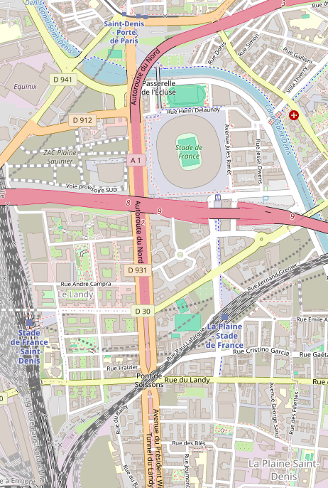
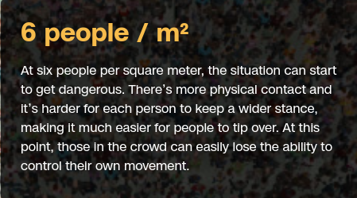

<!--

 Description 

-->

<!-- header: 'TIPE - Noé VINCENT' -->
# TIPE: Application de la théorie des graphes pour la gestion de Foules. 
Cas du Stade de France pendant les Jeux Olympiques
Noé VINCENT

---
# Motivation
A voir

---
# Plan
1. Analyse de la situation
2. Modélisation: Graphe de Capacité
3. Une méthode naïve
4. Une méthode optimale: le flot maximal
4. Analyse des résultats
5. Annexe

---
# 1. Analyse de la situation

---
# Situation Géographique

Le stade de France: 81 500 spectateurs 
3 stations de transport en commun aux alentours:
 - Saint-Denis Porte de Paris (M13)
 - La Plaine - Stade de France (RER B)
- Stade de France - Saint-Denis (RER D) 

 

Carte des alentours du Stade de France - @OSM

---
# Foules et risques

À partir de 6 personnes/m²,
-> Potentiel danger

On place la limite à 5 personnes/m²

 

 Issu de: These are the warning signs that a crowd is dangerously dense - @CNN

---

# 2. Modélisation: Graphe de Capacité

---
# Graphes de capacité
Soit $G_c = (V,E, C)$ un graphe non orienté pondéré par:

$C : E \rightarrow \mathbb{N}$ la capacité de chaque arête.

Le graphe des capacités.

---
# Modélisation de la capacité

Modélisation de piétons dans le pire des cas :

$\delta = 5 pers./m²$

Capacité d'une rue: débit maximal en pers./s

$c = \delta * w * v$
- $w$ la largeur de la rue 
- $v$ la vitesse de la foule
- $\delta$ la  densité de la  foule

 Étude expérimentale et modélisation des déplacements collectifs de piétons @Mehdi Moussaid 

---
# 4. Une methode optimale :  Le flot maximal

---
Soit $\varphi = (V,E,\phi)$ un graphe orienté pondéré par 
$\phi : E\rightarrow \mathbb{N}$ le flux passant dans chaque arètes.
Le graphe de flot.

---

# Propriétés des flots
$\forall a \in E,\phi(a)\le C(a)$
On définit:
$\phi⁺: u \in V \rightarrow \sum_{v|(u,v)\in E} \phi(u,v)$
$\phi^-: u \in V \rightarrow \sum_{v|(v,u)\in E} \phi(v,u)$
$\forall u \in V, \phi⁺(u) = \phi^-(u)$

---

