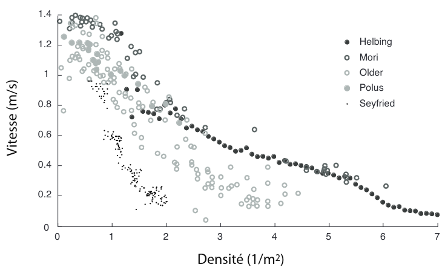

<!-- header: 'TIPE - Noé VINCENT' -->
# TIPE: Application de la théorie des graphes pour la gestion de Foules. 
Cas du Stade de France pendant les Jeux Olympiques
Noé VINCENT

---
# Motivation
A voir

---
# Plan
1. Analyse de la situation
2. Proposition de modélisation: Graphe de flot
3. Analyse des Algorithmes : Dijkstra (Widest Path) et Edmonds-Karp
4. Analyse des résultats
5. Annexe

---
# 1. Analyse de la situation

---
# Situation Géographique

Le stade de France: 81 500 spectateurs 
3 stations de transport en commun aux alentours:
 - Saint-Denis Porte de Paris (M13)
 - La Plaine - Stade de France (RER B)
- Stade de France - Saint-Denis (RER D) 

 

Carte des alentours du Stade de France - @OSM

---
# Foules et risques

 

 Issu de: These are the warning signs that a crowd is dangerously dense - @CNN

---

