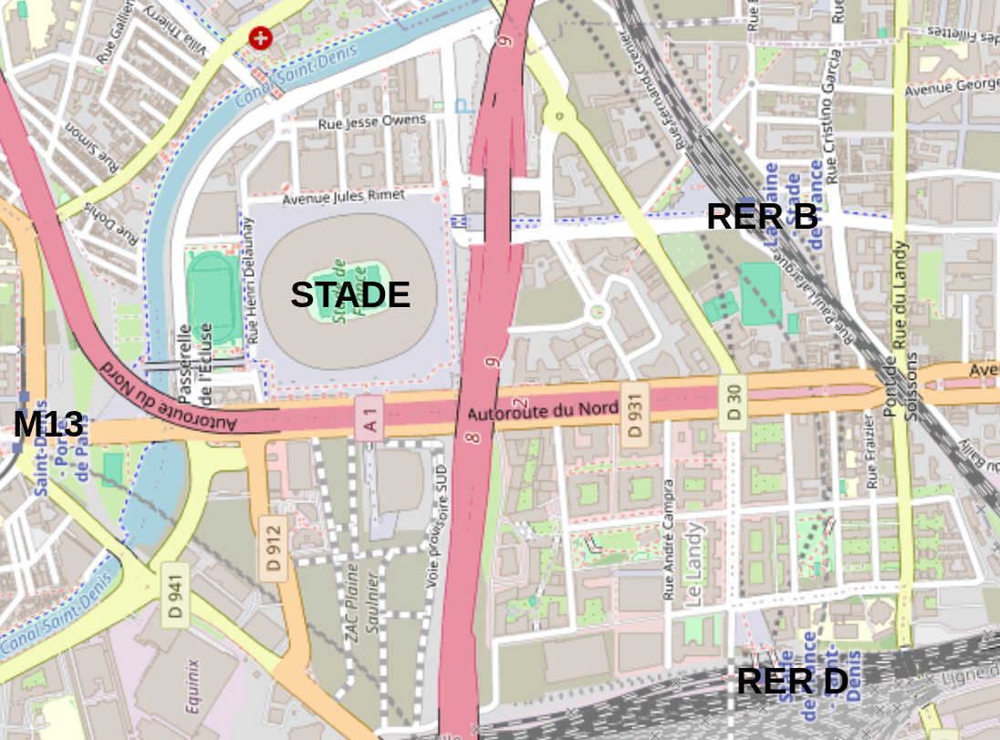
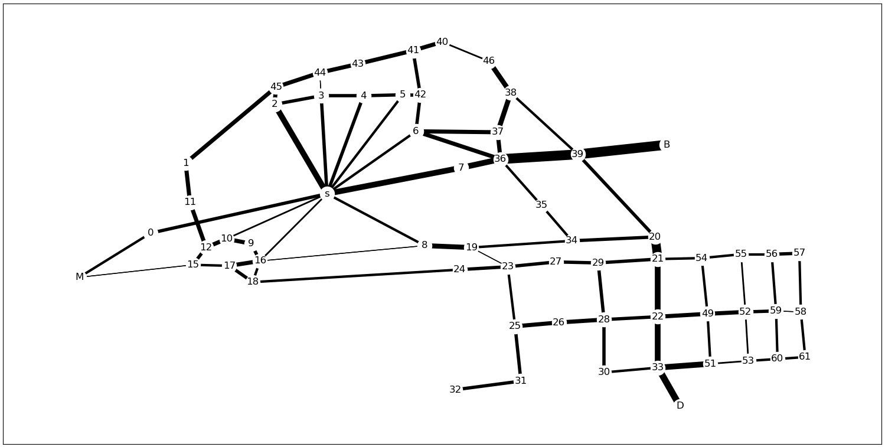
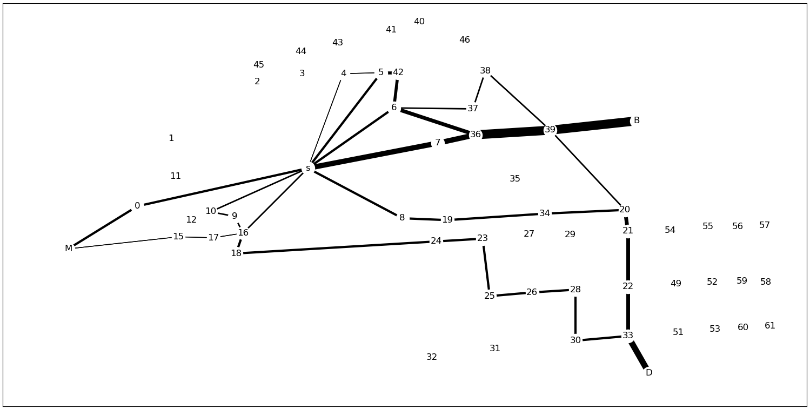

<!--

 Description 

-->

<!-- header: 'TIPE - Noé VINCENT' -->
# TIPE: Gestions des flux de spectateurs autour du stade de France par la théorie des graphes.
Définition d'itinéraires sécurisés pour évacuer le Stade de France.
Noé VINCENT

---
# Motivation
A voir

---
# Plan
1. Analyse de la situation
2. Modélisation: Graphe de Capacité
3. Une méthode naïve
4. Une méthode optimale: le flot maximal
4. Analyse des résultats
5. Annexe

---
# 1. Analyse de la situation

---
# Situation Géographique

Le stade de France: 81 500 spectateurs 
3 stations de transport en commun aux alentours:
 - Saint-Denis Porte de Paris (M13)
 - La Plaine - Stade de France (RER B)
- Stade de France - Saint-Denis (RER D) 

 

Carte des alentours du Stade de France - @OSM

---
# Foules et risques

À partir de 6 personnes/m²,
-> Potentiel danger

On place la limite à 5 personnes/m²

 

 Issu de: These are the warning signs that a crowd is dangerously dense - @CNN

---

# 2. Modélisation: Graphe de Capacité

---
### Graphes de capacités
Soit $G_c = (V,E, C)$ un graphe non orienté pondéré par:

$C : E \rightarrow \mathbb{N}$ la capacité de chaque arête.

Le graphe des capacités.

---
### Modélisations de la capacité

Modélisation de piétons dans le pire des cas :

$\delta = 5 pers./m²$

Capacité d'une rue: débit maximal en pers./s

$c = \delta * w * v$
- $w$ la largeur de la rue (approximée)
- $v$ la vitesse de la foule
- $\delta$ la  densité de la  foule

$v= 0,4m/s$ 

 Étude expérimentale et modélisation des déplacements collectifs de piétons @Mehdi Moussaid 

---
### Graphe de capacité

 Carte de la zone @OSM  

---
### Graphe  de capacité

 Graphe représentant la zone
 

---
# 3. Une méthode naïve
$\rightarrow$ les chemins de plus grande capacité entre le stade et les stations

---
### Capacité d'un chemin
$p \subset E$
$C(p) = min\left\{C(e), e \in p\right\}$

### L'algorithme de dijkstra
Chemin de poids minimal dans un graphe.

### Algorithme Widest Path
Algorithme de dijkstra modifié $\rightarrow$ chemin de capacité maximale 

---
### Proposition de solution

---
### Proposition de solution
Chemin le plus large entre le stade et le métro, largeur : 3

---
### Proposition de solution
Chemin le plus large entre le stade et le RER B, largeur 7

---
### Proposition de solution
Chemin le plus large entre le stade et le RER D, largeur 4

---

### Proposition de solution
Largeur théorique : $3+4+7 = 14$
Débit théorique : $28 pers/s$
Largeur réelle: $10$
Débit réel : $20 pers/s$
Temps d'évacuation : 1h08

---
# 4. Une methode optimale :  Le flot maximal
Algorithme d'Edmond-Karp

---
## Graphes de Flots

Soit $\varphi = (V,E,\phi,s,t)$ un graphe orienté pondéré par 
$\phi : E\rightarrow \mathbb{N}$ le flot passant dans chaque arètes.
Le graphe de flot.
$s$ : la source
$t$ : le puit

### Flot entrants et sortants dans un noeud
On définit:
$\phi⁻: u \in V \rightarrow \sum_{v|(u,v)\in E} \phi(u,v)$
$\phi⁺: u \in V \rightarrow \sum_{v|(v,u)\in E} \phi(v,u)$

---
## Propriétés des Flots

### Sources et puits
$\phi⁺(s) = 0$
$\phi⁻(t)) = 0$

### Valeur du flot
$V_{\phi} = \phi⁻(s)$

### Conservation du flot

$\forall u \in V\backslash\left\{s,t \right\}, \phi⁺(u) = \phi^-(u)$

---
### Graphe des augmentations
Soit $G_A = (V,E,C_r)$ un graphe orienté pondéré par:

$C_r : E \rightarrow \mathbb{N}$ la capacité restante de chaque arête.

Le graphe des augmentation.

### Chemin augmentant
$P = (p,d\phi)\in \mathbb{P}(E) * \mathbb{N}$

$p$ : ensemble d'arcs débutant à $s$ et finissant en $t$

$d\phi$ : variation du flot

---
## Algorithme d'Edmond-Karp

$EK :G_c \rightarrow \varphi_{max}$

### Objectif
Maximiser $V_{\phi}$

### Fonctionnement
Trouver des chemins augmentants dans $G_a$ afin d'augmenter le flux.

    Soit E-K(G_c = (V,E,C),pr):
      Phi <- Vide
      G_a <- (V+{t},
              E + {{puit ,t} pr},
              C_r(u,v) = C_r(v,u)  = C(u,v)
              )
      (P_a, dphi) = Chemin_augmentant(G_a)
      Tant P_a != Vide : 
        Mettre à jour G_a avec P_a, dphi
        Mettre à jour Phi avec P_a, dphi
      Renvoyer Phi
 Pseudo-Code de l'algorithme d'Edmond Karp 

- G_c le graphe des capacités
- pr les puits réels

---
## Algorithme d'Edmond-Karp
### Recherche du Chemin augmentant
Parcours en largeur : plus court chemin en nombre d'arc

### Arc avant 
Arc de $G_r$ dans le sens initial, le sens du flot

### Arc arrière
Arc de $G_r$ de sens inverse au flot, de capacité égale au flot.

---

### Mise à jour de $\varphi$
$\forall e=(u,v) \in p$ 
si e est un  arc avant:
$\phi(u,v) \leftarrow \phi(u,v)+ d\phi$

si e=(v,u) est un arc arrière :
$\phi(u,v) \leftarrow \phi(u,v)-d\phi$

### Mise à jour de $G_r$
$\forall e =(u,v) \in p, C_r(u,v) \leftarrow C_r(u,v) - d\phi$
$\forall e =(u,v) \in p, C_r(v,u) \leftarrow C_r(v,u) + d\phi$

---
### Exemple
Graphe de Capacité, graphe d'augmentation

---
### Exemple
Graphe de flot

---
### Exemple
Graphe d'augmentation, chemin augmentant

---
### Exemple
Graphe de flot

---
### Exemple
Graphe d'augmentation

---
### Exemple
Graphe d'augmentation, chemin augmentant

---
### Exemple
Graphe de flot

---
### Exemple
Graphe d'augmentation

---
### Exemple
Graphe d'augmentation, chemin augmentant

---
### Exemple
Graphe de flot

---
### Exemple
Graphe d'augmentation

---
### Exemple
Graphe d'augmentation, chemin augmentant

---
### Exemple
Graphe de flot

---
### Exemple
Graphe d'augmentation

---
### Exemple
Graphe d'augmentation, chemin augmentant

---
### Exemple
Graphe de flot

---
### Exemple
Graphe d'augmentation final

---
### Exemple
Graphe de flot final

---
### Résultats expérimentaux
Largeur : 23, débit : 46 pers/s, temps :30min
