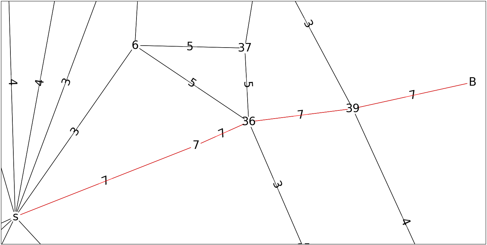
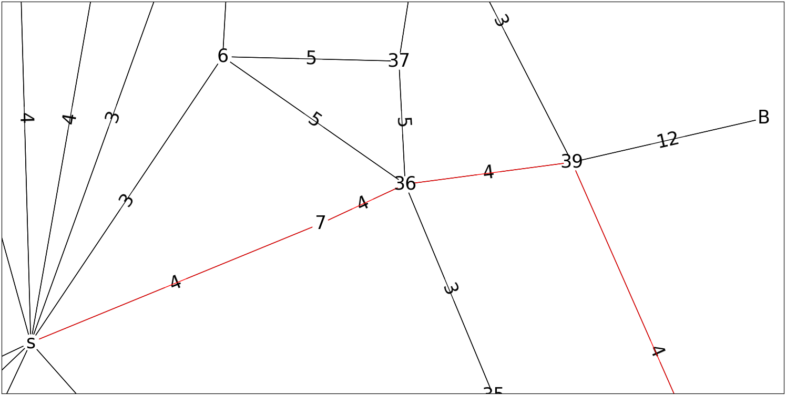
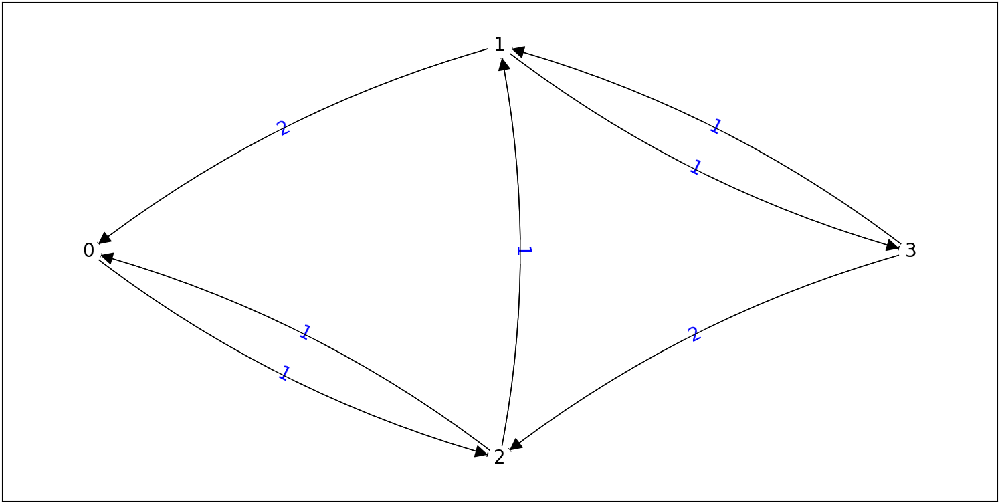
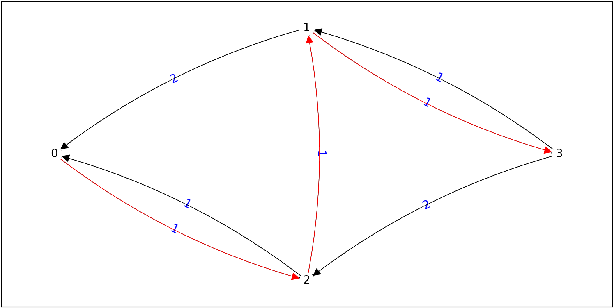
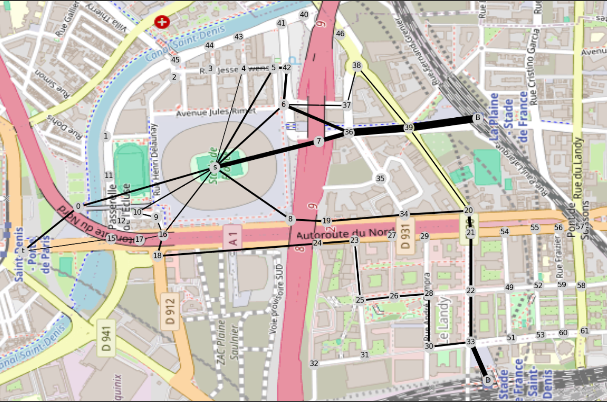
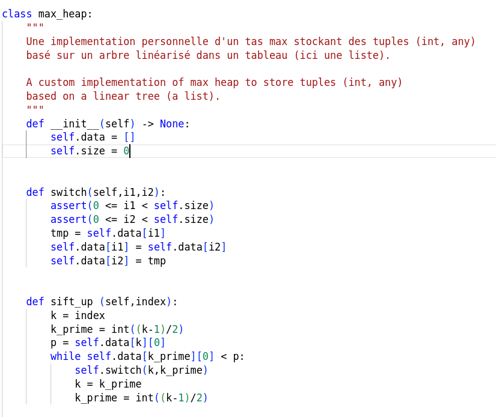
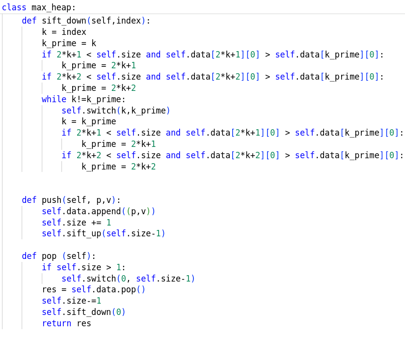
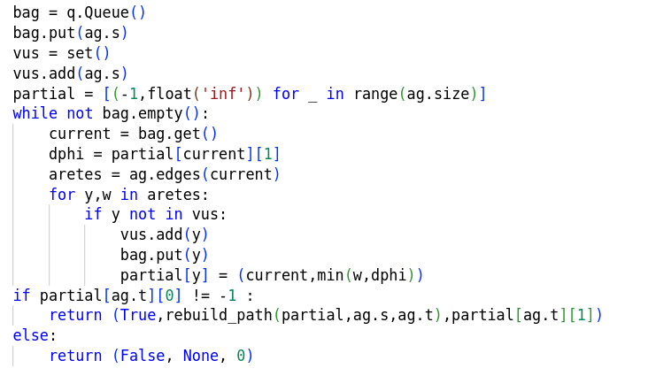
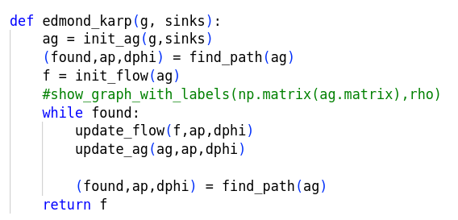
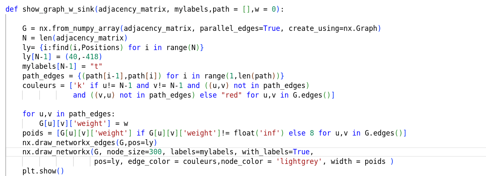

<!-- header: 'TIPE - Noé VINCENT - 32226' -->
# TIPE: Gestions des flux de spectateurs autour du Stade de France par la théorie des graphes.
Définition d'itinéraires sécurisés pour évacuer le Stade de France lors des Jeux Olympiques.
Noé VINCENT

---
## Comment utiliser la théorie des graphes pour définir les itinéraires piétons aux alentours du stade  de France ?
- maintenir la sécurité des spectateurs.
- le plus efficacement.

---
# Plan
1. Analyse de la situation
2. Modélisation: Graphe de Capacité
3. Une méthode naïve
4. Une méthode optimale: le flot maximal
4. Analyse des résultats
5. Annexe

---
# 1. Analyse de la situation

---
# Situation Géographique

Le stade de France: 81 500 spectateurs 
3 stations de transport en commun aux alentours:
 - Saint-Denis Porte de Paris (M13)
 - La Plaine - Stade de France (RER B)
- Stade de France - Saint-Denis (RER D) 

 

Carte des alentours du Stade de France - @OSM

---
# Critère de sécurité:

À partir de 6 personnes/m²,
-> Potentiel danger

On place la limite à 5 personnes/m²

Helbing & Mukerji -> trop grande densité: 
l'une des causes du drame de la Love Parade.

 

 Issu de: These are the warning signs that a crowd is dangerously dense - @CNN

---

# 2. Modélisation: Graphe de capacité

---
### Graphe de capacité
Soit $G_c = (V,E, C)$ un graphe non orienté pondéré par:

$C : E \rightarrow \mathbb{N}$ la capacité de chaque arête.

Le graphe des capacités.

---
### Modélisation de la capacité

Modélisation de piétons dans le pire des cas :

$\delta = 5 pers./m²$

Capacité d'une rue: débit maximal en pers./s

$c = \delta * w * v$
- $w$ la largeur de la rue (approximée)
- $v$ la vitesse de la foule
- $\delta$ la  densité de la  foule

$v= 0,4m/s$ 

 Étude expérimentale et modélisation des déplacements collectifs de piétons @Mehdi Moussaid 

---
### Graphe de capacité

 Carte de la zone @OSM  

---
### Graphe  de capacité

 Graphe représentant la zone
 

---
# 3. Une méthode naïve
$\rightarrow$ les chemins de plus grande capacité entre le stade et les stations

---
### Capacité d'un chemin
$p \subset E$
$C(p) = min\left\{C(e), e \in p\right\}$

### L'algorithme de dijkstra
Chemin de poids minimal dans un graphe.

### Algorithme Widest Path
Algorithme de dijkstra modifié $\rightarrow$ chemin de capacité maximale 

---
### Proposition de solution

---
### Proposition de solution
Chemin le plus large entre le stade et le métro, largeur : 3

---
### Proposition de solution
Chemin le plus large entre le stade et le RER B, largeur 7

---
### Proposition de solution
Chemin le plus large entre le stade et le RER D, largeur 4

---
## Analyse de la solution  

<section> Goulot d'étranglement  </section>
<section>   </section>
<section> Zoom sur le sud-est du graphe  </section>
<section> </section>

---

## Analyse de la solution

<section> Cannibalisme  </section>
<section>   </section>
<section> Zoom sur le sud-est du graphe </section>
<section> </section>

---

## Analyse de la solution
Largeur théorique : $3+4+7 = 14$
Débit théorique : $28 pers/s$

Largeur réelle: $10$
Débit réel : $20 pers/s$
Temps d'évacuation : 1h08

---
# 4. Une méthode optimale :  Le flot maximal
Algorithme d'Edmond-Karp

---
## Graphe d'éxemple

---
## Graphe de flot

Soit $\varphi = (V,E,\phi,s,t)$ un graphe orienté pondéré par 
$\phi : E\rightarrow \mathbb{N}$ le flot passant dans chaque arètes.

Le graphe de flot avec $s$ : la source, $t$ : le puit

---
### Propriétés des flots: conservation du flot

---
### Propriétés des flots: valeur du flot

$V_{\phi} =$ le flot total sortant de s

---

### Chemin augmentant

$(p,d_{\phi}), p\subset E, d_{\phi}\in \mathbb{N}$

---

### Flot saturé

---
### Flot maximal

---
### Graphe des augmentations

Soit $G_a = (V,E,C_r)$ un graphe orienté pondéré.

$C_r : E \rightarrow \mathbb{N}$ 
la capacité restante de chaque arête.

---
### Arcs avant, Arcs arrières

---
### Flot saturé

---
### Nouveau graphe des augmentations

---
### Nouveau chemin augmentant

---
### Flot maximal

---
### Graphe final des augmentations

---
## Algorithme d'Edmond-Karp

$EK :G_c \rightarrow \varphi_{max}$

### Objectif
Maximiser $V_{\phi}$

### Fonctionnement
Trouver des chemins augmentants dans $G_a$ afin d'augmenter le flux.

    Soit E-K(G_c = (V,E,C)):

      Phi <- Vide;
      G_a <- (V,
              E,
              C_r(u,v) = C_r(v,u)  = C(u,v));

      (P_a, dphi) = Chemin_augmentant(G_a);

      Tant que P_a existe : 
        Mettre à jour G_a avec P_a, dphi;
        Mettre à jour Phi avec P_a, dphi;
        (P_a, dphi) = Chemin_augmentant(G_a);
        
      Renvoyer Phi
 Pseudo-Code de l'algorithme d'Edmond Karp 

- G_c le graphe des capacités

---
## Algorithme d'Edmond-Karp
### Recherche du Chemin augmentant
Parcours en largeur : plus court chemin en nombre d'arc

-> Compléxité en $O(|V|*|E|²)$

Renvoie $(p,d\phi)$ un chemin augmentant

---

### Mise à jour de $\varphi$
$\forall e=(u,v) \in p$ 
si e est un  arc avant:
$\phi(u,v) \leftarrow \phi(u,v)+ d\phi$

si $e=(v,u)$ est un arc arrière :
$\phi(u,v) \leftarrow \phi(u,v)-d\phi$

### Mise à jour de $G_a$
$\forall e =(u,v) \in p, C_r(u,v) \leftarrow C_r(u,v) - d\phi$
$\forall e =(u,v) \in p, C_r(v,u) \leftarrow C_r(v,u) + d\phi$

---
## Dans le cas du stade de France
Capacité proportionnelle à la largeur de la rue.
Le puit: un noeud fictif relié par des arêtes de capacité maximale aux stations de transport en commun.
La source : Le stade de France
Objectif: 
- Le flot (un débit de personne) maximal, pour évacuer le plus éfficacement la foule.
---
### Graphe de capacité

---
### Résultats expérimentaux
Valeur du flot : $23$, débit : $46 pers/s$, temps :$30min$ 
($WP: 10, 20 pers/s$)

---
# 5. Analyse des résultats

---
## Comparaison W-P v. E-K
- Pas de Cannibalisme.
- Pas de goulot détranglement.
- Performance:
  E-K 2 fois plus rapide pour le même niveau de sécurité

---
## Critique du résultat

---
# 6. Annexe

---
## Idée de preuve pour la correction et la complexité d'Edmond-Karp
Correction: équivalence entre absence de chemin augmentant et flot maximal atteint. 

Complexité : si (u,v) est critique à deux moments distincts alors, u s'est éloigné de s d'au moins 2 entre ces deux moments, or $\delta(s,u)\le|V|$ donc (u,v) n'est critique qu'au plus $\frac{|V|-2} {2}$ fois. D'où nombre d'itération majoré par $|E|*|V|$ or chaque itération a une complexité en $O(|E|)$: parcours en largeur + màj $\varphi$ et màj $G_a$. 
$\rightarrow O(|V|*|E|²)$

---
### Code - Imports et Classe de graphe:

---

### Code - Classe de tas max:

---

### Code - Widest-Path, reconstruction du chemin:

---

### Code - Edmond-Karp et fonctions associées:

---

### Code - Edmond-Karp et fonctions associées:

---

### Code - Edmond-Karp et fonctions associées:

---
### Code - Graphe de capacité

Où DATA est un tableau contenant N triplets $(d,f,c)$ 
- $d,f \in V$ les extremités d'une arète 
- $c \in \mathbb{N}$ sa largeur.

Et Vertices un set contenant les somemts de G.

---
### Code - Affichage des graphes
Avec Positions un tableau associant à chaque noeud une position sur l'image. 

---
### Code - Affichage des graphes

